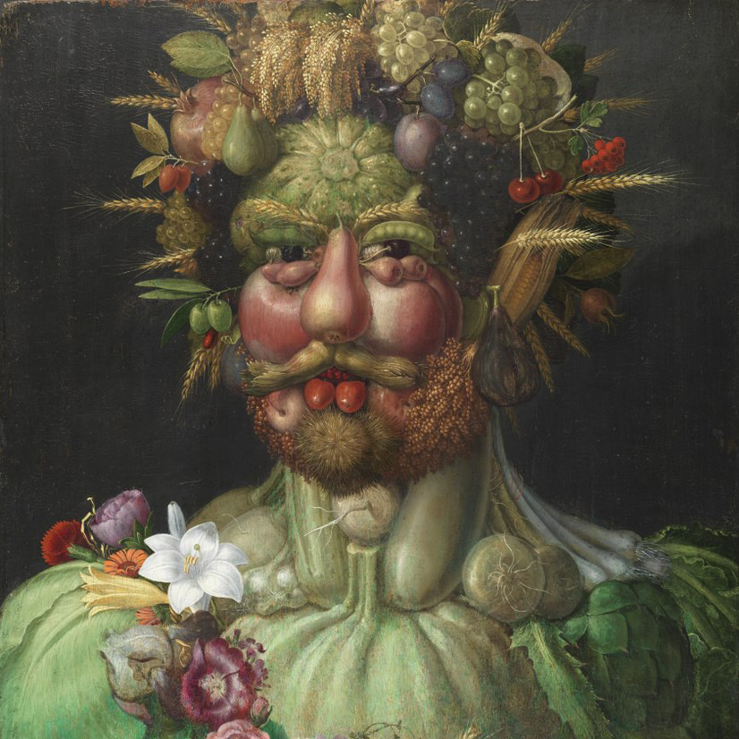

Mi tartja össze az Arcimboldo-portrékon a gyümölcsöket, merül fel a kérdés, ha egy rövid önelemzés eredményeként képes voltam magam egy kizárólag társadalmi elvárásokból és biológiai szükségletekből -- esetleg az ezekre válaszokból: szorongásokból, tagadásból -- álló képződménynek látni.
