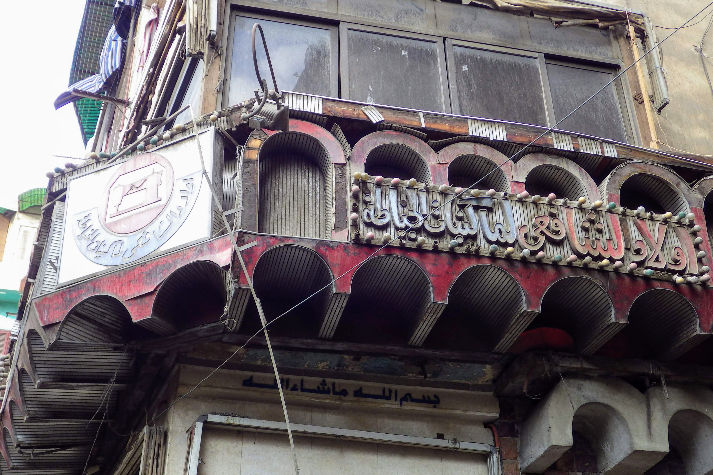

A [virágkiállítás][video] jutott eszembe a _Süsü, a sárkány_ból, ahol a tudósok olyan virágokat mutattak be, amikből kiküszöbölték az olyan felesleges tulajdonságokat, mint a szín meg az illat. Pedig a Kiskirályfinak azért inkább olyat kellene ajándékozni, amit még nem küszöböltek ki.

Magam mögött tudom Európát. Sétálok az utcán és szembesülök azzal, hogy nincsem minden rendben körülöttem, megnyugszom és otthon érzem magam. Ezt itt még nem küszöbölték ki.

[video]: https://youtu.be/_91AfBUU4ow?t=540