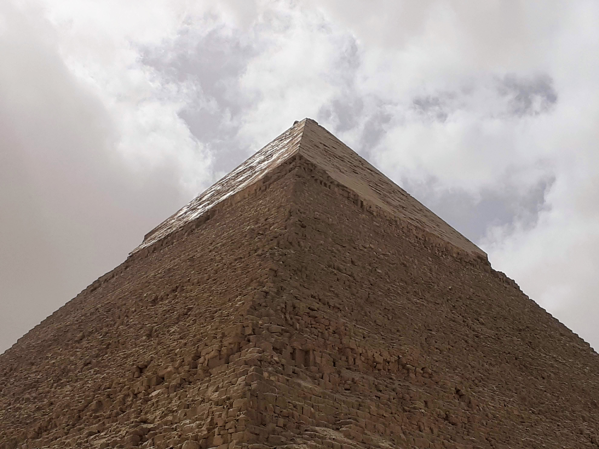

Ha megnézek egy úgynevezett turisztikai látványosságot, körbejárom, tanulmányozom a részleteket, elképzelem, hogy készítették vagy hogy használták. És észszerű időn belül hozzászokom. Elhelyezem a térképemen. De ehhez nem tudtam hozzászokni. Mert itt nincsenek részletek, és nem használták? Vagy a dolgok különbözőképpen létezhetnek? Mindenesetre azon kaptam magam, hogy már két órája nézek fel rájuk különböző helyekről, egyre nyugtalanabbul. Nem tudom hibáztatni azokat, akik szerint földönkívüliek építették.