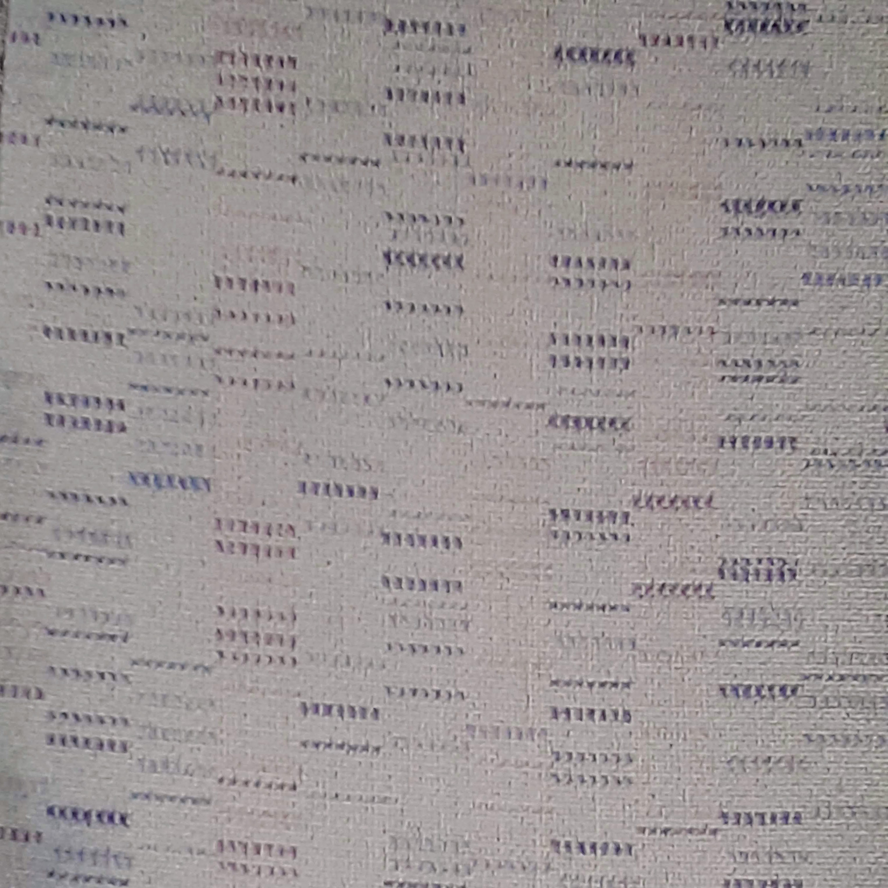

A vonaton, amivel késő este Szentgyörgytől Fenyvesig utaztunk, az ülések furcsa szövettel voltak bevonva. A mintázat pöttyei latin, héber, glagolita, devanagari betűkké alakultak és szavakat formáltak. Olvasásukkal kellemesen el lehetett tölteni az időt. Máriánál kaptunk észbe, hogy leszállás előtt ki kellene még olvasni belőlük egy-két lottószelvényre való számot is. Mondjuk 397421 és 718357, felosztani már nekünk kell. Másnap elbicikliztünk a fonyódi lottózóba és megjátszottuk.